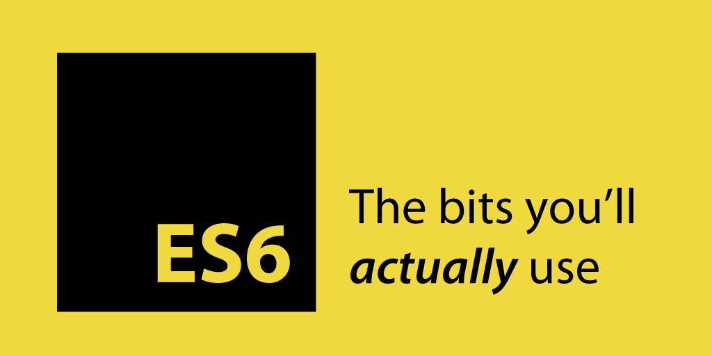

### webpack 발표자료 정리

# Javascript 모듈의 필요성

## Javascript의 문제점
* 글로벌(전역) 스코프가 쉽게 오염
* 동일한 이름을 가진 변수 사용
* 올바른 의존성 순서
* 웹페이지가 커질수록 script 태그 수 의 증가

자바스크립트를 어느정도 다뤄본 사람이라면 자바스크립트의 스코프 관리가 지저분하다는 것을 알 수 있습니다.

변수나 함수들이 global scope에 저장 되어 변수를 일일이 관리 해야하고 
다른 스크립트에서 실수로 중복 선언이 되면 서로 충돌하는 예기치 않은 문제점들이 빈번하게 발생. 
이로 인해 코드의 유지보수가 힘들어지고, 명확하지 않는 변수들이 생겨나게 됩니다.

각 파일이 어떤 파일들에 의존하고 있는지와 어떤 파일을 필요하지 않은지를 포함해서 파일들이 올바른 순서로 로드되도록 항상 신경을 써야 합니다.

웹 브라우저가 서버로부터 코드를 가져오기 위해 스크립트 태그 수 만큼 호출.
다수의 script 태그는 성능에 부정적인 영향을 줄 수 있습니다.


## Javascript의 전역 문제 해결 방법
즉시실행 함수 블럭에서 선언된 변수는 전역 스코프를 오염시키지 않습니다.
즉시 실행 함수 표현식(IIFE)은 선언되었을 때 바로 실행되는 익명 함수이다.

```js
//IIFE (Immediately Invoked Founction Expression)
(function() { 
    /* code here */ 
})();

//'App' 같은 하나의 전역객체 밑에 네임스페이스를 갖습니다. 
var App = App || {}; 
App.Models = {}; 
App.Models.Note = function() {};
```

## Javascript 모듈화 및 의존성 관리

코드베이스가 커지면 유지보수가 쉽도록 코드를 나누어 관리하는 모듈 시스템이 필요. (코드 모듈화)

2000년대 후반  자바스크립트가 브라우저 언어를 넘어 범용적으로 사용하기 위해 필요한 기술이 바로 모듈화였고, 이를 논의 하기 위해 자발적으로 만들어진 그룹이 CommonJS 워킹 그룹.

이 모듈 시스템은 Node.js에 도입되어 서버 사이드에서 큰 성공을 거두게 됩니다. 
그러나 이 방식은 모든 모듈 명세가 로컬 디스크에 있어야 했기 때문에 
브라우저 환경에서는 모든 모듈을 불러올 때까지 아무것도 할 수 없게되는 단점이 있었고, 그러한 비동기 모듈 로드 문제를 해결하고자 AMD 그룹이 탄생하게 됩니다.


- CommonJS
    - JS의 활용성을 높이려는 자발적 워킹그룹
    - JS를 범용 프로그래밍 언어로 만드는 것이 목적
    - JS 모듈 관리에 관한 코딩 표준을 제시함

## CommonJS
```js
var lib = require( "package/lib" );

function foo() {
    lib.log( "hello world!" );
}

module.exports = foo;
```

CommonJS에서 정의하는 전역변수는 module.exports와 require 객체가 있습니다.
exports로 모듈을 정의하고, require를 이용하여 모듈을 동기적으로 사용 할 수 있습니다.

필요한 파일이 모두 로컬 디스크에 있어 바로 불러 쓸 수 있는 상황, 
서버사이드에서는 AMD 방식보다 간결하게 사용.


- AMD (Asynchronouse Module Definition)
	- 웹 브라우저에서 JS 모듈 활용성을 높일 목적으로 CommonJS에서 파생됨
    - 가장 대표적으로 RequierJS
	- jQuery를 비롯 다수의 오픈소스 솔루션이 AMD를 지지
		- jQuery의 경우, 1.7부터 AMD 모듈 등록 기능을 지원하기 시작
	- CommonJS와 마찬가지로 JS 모듈 관리에 관한 코딩 표준을 제시함


## AMD 비동기 모듈 정의 (Asynchronous Module Definition)

```js
define(["package/lib"], function (lib) {
    function foo() {
        lib.log( "hello world!" );
    }
    return {
        foobar: foo
    }
});

require(["package/myModule"], function(myModule) {
    myModule.foobar();
});
```

AMD에서 정의하는 전역변수는 define와 require 객체가 있습니다.
define으로 모듈을 정의하고, 
require를 이용하여 모듈을 비동기적으로 사용합니다.

필요한 파일을 네트워크를 통해 내려받아야 하는 브라우저와 같은 환경에서는 
AMD가 CommonJS보다 더 유연한 방법을 제공 합니다.

AMD 명세는 define() 함수(클로저를 이용한 모듈 패턴)를 이용해 모듈을 구현하므로 전역변수 문제가 없다.

## UMD (Universal Module Definition)
AMD + CommonJS + IIFE 를 모두 지원하는 모듈
AMD, CommonJS 순으로 지원 여부를 확인하고, 둘 다 지원하지 않을 경우, IIFE 방식을 사용.

```js
(function (root, factory) {
    if (typeof define === 'function' && define.amd) {
        //AMD
        define(['jquery'], factory);
    } else if (typeof exports === 'object') {
        //Node, CommonJS-like
        module.exports = factory(require('jquery'));
    } else {
        //Browser globals (root is window)
        root.returnExports = factory(root.jQuery);
    }
}(this, function ($) {
    //methods
    function myFunc(){};
    //exposed public method
    return myFunc;
}));
```

## 모듈 시스템의 도입


이러한 모듈화의 움직임은 결국 언어자체의 스펙을 바꾸는데까지 영향을 끼치게 되었습니다.
ES6 스펙부터 언어자체적으로 모듈개념을 도입했습니다.
export와 import 키워드가 생겨남으로써 언어만으로도 처리할 수 있게 된 것이다. 

### ES6 Modules
```js
import lib from 'package/lib';

export function foo() {
    return lib.log( "hello world!" );
}
```

export로 모듈 선언 / import로 모듈 사용

import와 export라는 새로운 구문을 통해서 스크립트간의 관계를 규정하고 
상호간에 스크립트를 읽어들여올수 있게 되면서 
타 프로그래밍 언어와 같이 스크립트들을 모듈화 함으로써 
관리를 보다 손쉽게 할 수 있게 되었다. 

프로그램을 가능한 최대한으로 작은 유닛으로 모듈화 하여서 
언제 어디서든 필요할때마다 재사용할수 있게 만드는 것이다.


안타깝게도 ES6가 2015년에 나온지 2년이 지난 지금에도 브라우저(크롬, 파이어폭스, 기타 등등) 내에서 import나 export는 아직 구현되지 않은 기능이다. 
- [ES6 - Module 브라우저 지원 상황](http://caniuse.com/#feat=es6-module)


아직 브라우저에서 지원이 되지 않는 모듈(import, export)을 사용하기 위해서는
Bundler 혹은 Preprocessor(프리프로세서)등을 사용해서 안정적인 자바스크립트로 컴파일 해주어야 합니다.

다른 번들러로는 Browserify, webpack 등이 있다. 
하지만 요즘에는 webpack으로 대세가 굳어진 느낌이다.

# webpack 소개

## webpack, 모듈 번들러란?
웹 서비스를 개발할 때 자바스크립트로 작성하는 코드의 양이 많아지면 유지보수가 쉽도록 코드를 모듈로 나누어 관리하는 모듈 시스템이 필요.
아직 브라우저 에서 import나 export가 구현되지 않음. (모듈 번들러가 기능을 대신 지원)
webpack은 이런 한계를 극복하기 위한 도구 중 하나로 자바스크립트 모듈화 도구.


그림 1. 모듈 번들러 웹팩


웹 페이지는 수 많은 구성요소로 이루어져 있습니다.
기본적인 html, js, css, 이미지 파일 외에도, 웹폰트, json 데이터 등등 수 많은 파일들을 받아와야 합니다. 

http/2에서는 하나의 커넥션에 동시에 여러 파일들을 요청할 수 있습니다. 
하지만 아직 보편화되어있지 않기 때문에 현재 주로 사용하는 
http/1.1에서는 커넥션 하나를 열어 하나씩 요청을 보내야합니다. 
하나의 요청이 끝나야 다음 요청을 보낼 수 있기 때문에 요청이 많을수록 비효율적

개발자인 저희가 희생해야죠. 
바로 요청 수를 줄이는 겁니다! 
그래서 이미지는 스프라이트로 만들어 한 번에 받고, 
걸프, 그런트같은 번들러로 js파일이나 css파일을 하나로 합치곤 했죠. 
그러다가 이제 번들러 끝판왕 웹팩이 나왔습니다. 
아래의 그림처럼 여러 파일들을 하나로 합쳐줍니다.

하나의 파일로 합치기엔 너무 크다면 여러 개의 파일로 나눌 수도 있습니다. 
보통 라이브러리들은 자주 수정되지 않기 때문에 라이브러리만 모아둔 JS 파일 하나를 만들고, 
코드 수정이 자주되는 핵심 페이지는 따로 하나 만들어서 두 개의 JS가 생성됩니다. 

주의할 점은 import랑 require을 쓰지 않고 그냥 지금처럼 스크립트 주르륵 불러오는 방식으로 코딩하신 분은 웹팩의 장점을 누릴 수 없습니다.
그런 분들은 모듈 시스템 부터 공부


프론트엔드가 중요해지면서 JS자체만으로도 엄청난 의존 관계.
webpack은 여러가지 디펜던시(의존성)들을 효율적인 방법으로 통합하여 하나의 번들 파일로 생성.
이렇게 번들링된 파일을 브라우저(HTML)에서 로드.


### webpack의 주요기능? 
SASS나 LESS와 같은 CSS 프리프로세서를 사용한 적이 있다면 코드를 일반 CSS로 변환해야 한다는 것은 알고 있을 것입니다.

ES6, TypeScript나 다른 자바 스크립트 언어를 사용 해본 적이 있다면 하위 브라우저를 위해 변환 단계가 있다는 것을 알고 있을 것입니다.

webpack이 정말 좋은 점은 다양한 종류의 코드를 변환 시킬 수 있습니다. 

HTML, CSS, 이미지마저 자바스크립트 내부에서 로드 가능합니다.
이제까지 index.html에 각 플러그인 마다 필요한 자바스크립트와 
CSS파일들을 일일이 써넣어주어야 하는 것이 상당히 귀찮은 작업이었지만,
웹팩을 이용하면 직관적이고 효율적으로 디펜던시(종속성)들을 관리 할 수 있습니다.


# webpack으로 웹 개발환경 만들기 (설치 가이드)

## Node.js 설치
webpack을 사용하기 위해선 Node.js가 필수로 설치 되어 있어야 합니다.
아래 사이트를 방문하여 OS에 맞는 버전으로 설치합니다.
- Node.js 소개 - [http://d2.naver.com/helloworld/4994500](http://d2.naver.com/helloworld/4994500)
- Node.js 다운로드 - [https://nodejs.org/ko/](https://nodejs.org/ko/)

## 디렉터리 구조
```bash
[webpack2-demo]
├── dist               # output 디렉토리, 프로덕션 환경 배포 파일
├── node_modules       # npm package들이 설치된 디렉토리
├── src
│   ├── app.js
│   └── app.css
├── index.html
├── package.json       # 프로젝트 구성 정보
└── webpack.config.js  # 웹팩 설정 파일
```

## 프로젝트 초기화
커맨드를 실행 후, 프로젝트 폴더로 이동해서 Node.js 프로젝트를 생성합니다.

```bash
$ npm init (enter skip)
```
package.json 파일이 생성되었습니다.

잠깐 살펴보는 리눅스, npm 명령어
```bash
$ mkdir [folderName] # 디렉토리 생성
$ touch [fileName]   # 파일 생성
$ npm init -y        # 입력 생략
$ npm i jquery       # i  === install
$ npm i -S jquery    # -S === --save
$ npm i -D jquery    # -D === --save-dev
$ npm un -D jquery   # un === uninstall

# Node.js Path API
# 현재 파일 경로
__filename;  # D:\workspace\diagram\main.js
# 현재 디렉토리
__dirname;   # D:\workspace\diagram
# 경로 연결
path.join(__dirname, '/test') # /home/dirname/test
# 상대적인 경로로 연결
path.resolve('/foo/bar', './baz') # /foo/bar/baz
```

## webpack 설치
webpack을 시작하기 위해서 전역 또는 로컬(프로젝트내)에 설치해야합니다.

```bash
$ npm install webpack -g
or
$ npm install webpack --save-dev
```

webpack을 전역으로 설치할 수도 있지만<br>
이렇게 하면 프로젝트별로 서로 다른 버전을 사용할 수가 없고,
프로젝트 의존성에 포함될 수 없게됩니다.<br>
webpack CLI 팩키지는 가능한 로컬에 설치해서 상대 경로를 사용하거나 npm 스크립트로 팩키지를 실행하는 것이 좋습니다.

전역에 설치함으로써 webpack 명령어를 사용할 수 있고, 
로컬에 설치함으로써 어떤 버전의 webpack을 프로젝트가 전역으로 설치하지 않고 사용할 수 있는지 알 수 있습니다.


## 빌드된 코드를 로드할 html 파일
html5 기본 템플릿 (vscode: !+tab)
```html
<!-- index.html -->
 <html>
    <head>
        <meta charset="utf-8">
    </head>
    <body>
        <h1>Hello webpack</h1>
        <script type="text/javascript" src="dist/app.bundle.js"></script>
    </body>
</html>
```
index.html파일을 보시면
우리가 아직 만들지 않은 app.bundle.js파일을 로딩하는 코드인것을 알 수있습니다.
```js
//------ app.js ------
console.log('Hello webpack');
```     


## 번들 파일 생성 (app.bundle.js)
webpack 을 설치한 뒤, 다음과 같이 명령어를 실행하여 모듈을 컴파일할 수 있다.
```bash
# webpack {엔트리 파일 경로} {번들 파일 경로}
$ webpack ./src/app.js ./dist/app.bundle.js
```

아직 만들지 않은 dist폴더에 app.bundle.js 파일을 만들어야 합니다.
app.js가 app.bundle.js에 코드가 포함되어서 번들링 되었서 실행된 결과가 화면에 나왔습니다.

여기까지는 아직 웹팩의 효과가 전혀 나타나지 않았습니다. 오히려 파일에 용량만 커졌기때문에 좀 더 기능을 추가해봅니다.


## ES6 module 사용해 보기

```js
//------ hello.js ------
export default function hello() {
    console.log('Hello webpack');
}   
```

```
//------ app.js ------
import hello from './hello';
hello();
//console.log('Hello webpack');
```


## watch 모드
watch 모드는 프로젝트의 js 소스코드가 변경될 때마다 자동으로 감지해서 다시 bundle.js 파일을 만들어주는 기능.
개발중에는 주로 watch 모드를 이용.

```bash
# 엔트리 파일 변경시 자동 리빌드
$ webpack ./src/app.js ./dist/app.bundle.js --watch
or
$ webpack ./src/app.js ./dist/app.bundle.js -w
```

## use -p for production, minified code
```bash
# minified code
$ webpack ./src/app.js ./dist/app.bundle.js -p
```


## webpack의 기본적인 4가지 컨셉
웹팩을 이해하는데 있어서 기본적인 4가지 컨셉 간단하게 정리하고 넘어가겠습니다.

* Entry: 웹팩이 파일을 읽어들이기 시작하는 부분을 설정.
'여기서부터 시작해서, 여기에 추가된 의존성을 따라서 번들링해라'라고 지정해주는 것입니다.

* Output: 결과물이 어떻게 나올지 설정.
번들링이 끝난 후 결과물을 어느 경로에 놓고, 무슨 파일명으로 저장할 지 등을 설정

* Module: 웹팩을 통해 번들링을 진행할 때 처리해야 하는 태스크들을 실행.
웹팩은 다양한 형식의 확장자들(.css, .html, .scss, .jpg.. 등)을 모듈로 취급 함께 빌드 할 수 있도록 도와줍니다.
babel과 같이 트랜스파일러를 사용해서 ECMA2015(ES6) 문법을 ES5 문법으로 바꿔주는 경우에도 사용할 수 있다. 

module 옵션은 webpack을 통해 bundling을 진행할 때 처리해야 하는 task들을 실행할 때 사용합니다. ES5 문법을 사용하기 위해 먼저 babel을 통해 transpile을 해야 하는데 이 작업을 babel-loader를 통해 설정해줄 수 있습니다. 
또 javascript 파일 뿐만 아니라 css 파일을 load해야하는 경우에는 css-loader를 사용할 수 있습니다.


* Plugins: 확장기능

다양한 플러그인을 통해 효과적으로 번들링을 할 수 있습니다. 
코드를 난독화(Uglify)하여 압축할 수 있고, 
공통된 코드(Common chunk)를 분리할 수 있고, 
코드를 저장 할때마다 자동으로 리로딩(HotModuleReplacement)할 수 있습니다. 

사용하지 않는 코드들을 처리하고
예를 들면 압축을 한다거나, 핫리로딩을 한다거나, 파일을 복사하는 등의 부수적인 작업을 할 수 있습니다.

## webpack 설정 파일
```bash
#webpack.config.js 생성
$ touch webpack.config.js
```

```js
//------ webpack.config.js ------ 
module.exports = {
    entry: './src/app.js',
    output: {
        filename: './dist/app.bundle.js'
    }
}
```

```js
//------ package.json ------
"scripts": {
    "dev": "webpack -d --watch",
    "prod": "webpack -p"
}
```
```bash
$ npm run dev # 디벨로프 모드
or
$ npm run prod # 프로덕션 모드
```

### Multiple files, bundled together
```js
const path = require('path');

module.exports = {
  context: path.resolve(__dirname, './src'), //모듈 파일 폴더
  entry: {
    app: ['./home.js', './events.js', './vendor.js'],
  },
  output: {
    path: path.resolve(__dirname, './dist'),
    filename: '[name].bundle.js',
  },
};
```
dist/app.bundle.js 배열 순서대로 하나의 파일 로 함께 묶입니다.

### Multiple files, multiple outputs
또는 여러 개의 JS 파일을 번들로 묶어 앱의 일부분을 분리 할 수도 있습니다. 
```js
const path = require('path');

module.exports = {
  context: path.resolve(__dirname, './src'), //모듈 파일 폴더
  entry: {
    home: './home.js',
    events: './events.js',
    contact: './contact.js',
  },
  output: {
    path: path.resolve(__dirname, './dist'),
    filename: '[name].bundle.js',
  },
};
```
3개 번들 파일로 제공됩니다. 
dist/home.bundle.js, 
dist/events.bundle.js,
dist/contact.bundle.js.

## HTML webpack Plugin
html-webpack-plugin 이용해서 index.html 자동으로 만들기
[html-webpack-plugin](https://github.com/jantimon/html-webpack-plugin)

.js를 배포하다보면 캐쉬 문제로 v= 을 붙여 주어야 할 때가 많다.
html-webpack-plugin을 이용하면 .html에 들어갈 내용을 내가 외부에서 동적으로 바꿔서 생성을 할 수 있다.
minify 옵션으로 min 파일을 만들 수 있고, ejs템플릿을 사용할 수도 있다.

[ejs템플릿](https://github.com/mde/ejs)


```bash
$ npm i html-webpack-plugin --save-dev
```

```js
//------ webpack.config.js ------
const HtmlwebpackPlugin = require('html-webpack-plugin');
const path = require('path');

module.exports = {
    // ...
    plugins: [
        new HtmlwebpackPlugin({
            title: 'Project Demo',
            minify: {
                collapseWhitespace: true
            },
            hash: true,
            template: './src/index.html'
        })
    ]
}
```

```html
//----- index.html -----
<!DOCTYPE html>
<html>
    <head>
        <meta http-equiv="Content-type" content="text/html; charset=utf-8"/>
        <title><%= htmlWebpackPlugin.options.title %></title>
    </head>
    <body>
        <div id="root"></div>
    </body>
</html>
```


rules(loaders) : 값으로 배열을 받으며, 어떤 파일에 어떤 로더를 적용할지 등을 설정
test : 정규표현식 값이 오게 되며, 적용할 파일의 패턴을 넣으면 된다.
exclude : exclude 값으로 적힌 정규식에 해당되는 파일들은 로더의 영향을 받지 않는다.

## Style, CSS and Sass loaders
css-loader는 css 파일들을 읽어주고 style-loader는 읽은 css 파일들을 style 태그로 만들어 head 태그 안에 넣어줍니다. 만약 style 태그 대신 css파일로 만들고 싶은 경우에 extract-text-webpack-plugin을 사용하면 됩니다.

- css-loader: css파일을 자바스크립트에 포함
- style-loader: html에 브라우저에서 스타일 적용 style태그로 head부분에 넣어준다.

```bash
# css-loader, style-loader
$ npm i css-loader style-loader --save-dev

# Sass-loader
$ npm i sass-loader node-sass --save-dev

# Scss 순수 css 변환
$ npm i extract-text-webpack-plugin --save-dev
```
```js
//------ webpack.config.js ------
var ExtractTextPlugin = require("extract-text-webpack-plugin");
var path = require('path');

module.exports = {
    // ...
    module: {
        rules: [
            {
                test: /\.scss$/,
                use: ExtractTextPlugin.extract({
                    fallback: 'style-loader',
                    use: ['css-loader','sass-loader'],
                    publicPath: '/dist'
                })
            }
        ]
    },
    plugins: [
        new ExtractTextPlugin({
            filename: 'app.css',
            disable: false,
            allChunks: true
        })
    ]
}
```


## Style, CSS and Sass loaders

```bash
npm i css-loader --save-dev (css파일을 자바스크립트에 포함)
npm i style-loader --save-dev (html에 브라우저에서 스타일 적용 style태그로 head부분에 넣어준다.)

npm install --save-dev css-loader style-loader (한번에)
```

**webpack.config.js**
```js
module: {
    rules: [{
        test: /\.css$/,
        use: [ 'style-loader', 'css-loader' ]
    }]
}
```

**sass-loader 설치**
```bash
npm i sass-loader node-sass --save-dev
```

**webpack.config.js**
```js
module: {
    rules: [{
        test: /\.(css|scss)$/,
        use: [ 'style-loader', 'css-loader', 'sass-loader' ]
    }]
},


module: {
    rules: [{
        test: /\.scss$/,
        use: [ 'style-loader', 'css-loader', 'sass-loader' ]
    }]
}

module: {
    rules: [{
        test: /\.scss$/,
        use: [{
            loader: "style-loader"
        }, {
            loader: "css-loader"
        }, {
            loader: "sass-loader",
            options: {
                includePaths: ["absolute/path/a", "absolute/path/b"]
            }
        }]
    }]
}
```

## scss 변환 순수 css로
```bash
npm i extract-text-webpack-plugin --save-dev
```

**webpack.config.js**
```js
const ExtractTextPlugin = require("extract-text-webpack-plugin");

module: {
	rules: [{
	    test: /\.scss$/,
	    use: ExtractTextPlugin.extract({
	    	fallback: "style-loader",
	     	use: ['css-loader', 'sass-loader'],
	     	publicPath: '/dist'
	    })
	}]
},
plugins: [
    new ExtractTextPlugin({
		filename: 'app.css',
		disabled: false,
		allChunks: true
	})
]


const extractSass = new ExtractTextPlugin({
    filename: "[name].[contenthash].css",
    disable: process.env.NODE_ENV === "development"
});

module.exports = {
    ...
    module: {
        rules: [{
            test: /\.scss$/,
            use: extractSass.extract({
                use: [{
                    loader: "css-loader"
                }, {
                    loader: "sass-loader"
                }],
                // use style-loader in development
                fallback: "style-loader"
            })
        }]
    },
    plugins: [
        extractSass
    ]
};
```

```js
//------ app.js ------
const css = require('./app.scss');
```


### RimRaf
* dist 폴더 파일 삭제
rimraf 명령어를 통해 삭제 가능합니다. 
먼저 rimraf 모듈을 설치합니다.
rimraf 명령을 통해 원하는 폴더 경로를 입력해서 삭제합니다.

```bash
$ npm i rimraf --save-dev
```

```js
//------ package.json ------
 "scripts": {
	"dev": "webpack-dev-server",
    "prod": "npm run clean && NODE_ENV=production webpack",
	"clean": "rimraf ./dist/*"
}
```


### UglifyJS Plugin
minify를 통해 소스 용량을 줄여주고, uglify를 통해 난독화 및 console.log를 제거해 주는 기능


```js
//------ webpack.config.js ------
const webpack = require('webpack');

module.exports = {
  plugins: [
    new webpack.optimize.UglifyJsPlugin({
        compressor: {
            warnings: false
        }
    }),
  ]
}
```


### How to load images with webpack
https://github.com/webpack-contrib/file-loader
css background url(...) 이미지를 가져올수없음 에러남
CSS, Image 파일을 외부 파일로 추출하기 위한 webpack.config.js 설정

웹팩은 css, image 등을 하나의 모듈로 인지하고 번들링 파일로 추출
기본적으로 html 파일에서  를 선언하고 번들링시 해당 이미지 파일을 의존성 트리에 추가하기 위해서는 번들링 파일에서 별도로 require('image.png') 선언할 필요가 있다.

use: "file-loader?name=[name].[ext]&publicPath=assets/foo/&outputPath=app/images/"

```bash
$ npm i file-loader --save-dev
$ npm i image-webpack-loader --save-dev
```

```js
//------ webpack.config.js ------
module: {
    rules: [
        { 
            test: /\.(jpe?g|png|gif|svg)$/i, 
            use: [
                    'file-loader?name=images/[name].[ext]',
                    'image-webpack-loader' 
            ]
        }
    ],
}


{ 
    test: /\.(jpe?g|png|gif|svg)$/i, 
    use: ['file-loader?name=img/[name].[ext]&publicPath=assets/foo/&outputPath=app/images/']
}
```

### file-loader와 url-loader
웹팩에서 이미지나 폰트같은 파일을 다루는데 file-loader와 url-loader를 많이 사용하는 것 같다.
파일을 처리하는 file-loader와 파일 내용을 모듈에 문자열 형태로 추가하는 url-loader


### PurifyCSS Plugin How to optimize your css stylesheet

메인 폴더에있는 html파일을 체크해서 사용되고 있는 필요한 css만 최적화

PurifyCSS Plugin https://github.com/webpack-contrib/purifycss-webpack

```bash
npm i -D purifycss-webpack purify-css
```
```js
//------ webpack.config.js ------
const path = require('path');
const glob = require('glob');
const PurifyCSSPlugin = require('purifycss-webpack');

module.exports = {
  plugins: [
    new PurifyCSSPlugin({
      // Give paths to parse for rules. These should be absolute!
      paths: glob.sync(path.join(__dirname, 'main/*.html')),
    })
  ]
}
```


## webpack dev server
https://webpack.js.org/configuration/dev-server/#components/sidebar/sidebar.jsx

```bash
$ npm i webpack-dev-server --save-dev
```

```js
//------ webpack.config.js ------
module.exports = {
    devServer: {
        contentBase: path.join(__dirname, 'dist'),
        compress: true,
        port: 8080,
        stats: 'errors-only',
        hot: true,
        open: true,
        historyApiFallback: true
    },
}
```

```js
//------ package.json ------
"scripts": {
    "dev": "webpack-dev-server",
    "prod": "webpack"
}
```

```bash
$ npm run dev
```

'hot' VS 'inline' webpack-dev-server options

inline 은 전체 페이지에 대한 실시간 리로딩(Live Reloading) 옵션이며, 
hot 은 컴포넌트가 수정 될 경우 그 수정된 부분만 리로드 해주는 부분 모듈 리로딩(Hot Module Reloading) 옵션이다. 
만약 두개 옵션을 모두 지정할 경우 Hot Module Reloading이 처음 발생한다. 
그리고 Hot Module Reloading이 안되면 전체 페이지 로딩을 한다.

```bash
# 페이지를 로딩하지 않는다.
$ webpack-dev-server

# 전체 페이지를 로딩 한다.
$ webpack-dev-server --inline

# 부분 로딩
$ webpack-dev-server --hot
```

## HMR (Hot Module Replacement) 사용하기
webpack-dev-server 를 사용함으로써 우리는 hot module replacement 설정할 수 있다. 
우리가 코드를 수정하거나 추가하고 저장할 때마다 webpack 이 이를 감지하고 페이지를 새로고침할 필요도 없이 코드를 수정하여준다.

live-reload 기능이 있긴 하지만, 페이지 전체를 다시 불러오는 형태라서 비효율적으로 볼 수도 있다. 에디터에서 수정 후 저장하자마자 깜빡임도 없이 브라우저에 있는 UI가 바로 바뀌는 모습이 인상적.
CSS 수정했을 때 유용

```js
//------ webpack.config.js ------
const webpack = require('webpack');

module.exports = {
    module: {
        rules: [
            {
                test: /\.scss$/,
                use: ['style-loader', 'css-loader?sourceMap', 'sass-loader?sourceMap']
            }
        ],
    },
    devServer: {
        contentBase: path.join(__dirname, 'dist'),
        compress: true,
        port: 8080,
        stats: "errors-only",
        hot: true,
        open: true
    },
    plugins: [
        new ExtractTextPlugin({
            filename: 'app.css',
            disable: true,
            allChunks: true
        }),
        new webpack.HotModuleReplacementPlugin(),
        new webpack.NamedModulesPlugin()
    ]
}
```


### Setting up React and Babel

IE환경을 지원하면서도 ES2015를 쓰기 위해서는 babel 같은 트랜스파일러(Transpiler)가 필수다. webpack에서는 이를 위해 babel-loader에 통과시켜서 ES5 이하의 JavaScript로 만든다.

babel-loader를 사용하기 위해서 먼저 babel-loader를 설치한다.

```bash

$ npm i --save-dev babel-loader babel-core babel-preset-env

# .babelrc 파일생성
$ touch .babelrc
```

```js
//------ .babelrc ------
{
    "presets": ["env"]
}
```

```js
//------ webpack.config.js ------
module: {
    rules: [
        {
            test: /\.js$/,
            exclude: /node_modules/,
            use: {
                loader: 'babel-loader',
                options: {
                    presets: ['env']
                }
            }
        }
    ]
}
```


설명을 하고 넘어가야 할 것 같다. 먼저, babel을 사용하기 위해서는 preset을 설치해야 한다. 그 중 babel-preset-env는 설정된 환경에 알맞게 preset을 자동으로 설정해준다. 이 라이브러리를 사용하기 위해서 presets 라는 속성을 사용해서 환경을 설정할 수 있다. 위의 파일에서 설정된 환경은 브라우저 별로 최신의 두 개 버전만을 고려하는 환경이다. 지원하는 브라우저의 리스트는 
이 곳에서 확인할 수 있다.
http://browserl.ist/?q=last+2+versions

이제부터 프로젝트에 포함된 모든 .js 확장자 파일은 babel-loader를 거치면서 ES5로 트랜스파일된다. 코드를 ES2015로 변경하여 테스트 해보자.

```js
// Cat.js
export default class {
    constructor(name){  // 생성자
        this.name = name;
    }

    // 함수
    getName(){
        return `Name is ${this.name}`;  // ECMA2015 templates
    }

    bawl(){
        return "야옹~~~~~~";
    }
}

```
```js
//------ app.js ------
import Cat from './Cat'

let myCat = new Cat("Momo");
console.log(myCat.getName()); // Name is Momo
console.log(myCat.bawl());   // "야옹~~~~~~"


// hello.js
export default 'Hello';
// world.js
export default 'world';

// entry.js
import hello from './hello';
import world from './world';

document.getElementById('demo').innerHTML = `${hello}, ${world}!`;
```


## React 
```bash
$ npm i react react-dom --save-dev

$ npm i babel-cli babel-core babel-loader babel-preset-env babel-preset-react --save-dev


# .babelrc 파일생성
$ touch .babelrc
```

```js
//------ .babelrc ------
{
    "presets": ["env", "react"]
}
```

```js
//------ webpack.config.js ------
module: {
    rules: [
        {
            test: /\.js$/,
            exclude: /node_modules/,
            use: {
                loader: 'babel-loader',
                options: {
                    presets: ['env', 'react']  // ES2015, React를 이용해서 빌드한다.
                }
            }
        }
    ]
}
```

```js
//------ app.js ------
const css = require('./app.scss');

import React from 'react';
import ReactDOM from 'react-dom';

ReactDOM.render(
  <h1>Hello, world!</h1>,
  document.getElementById('root')
);


import React from 'react';
import ReactDOM from 'react-dom';
import { App } from './App';

ReactDOM.render(
    <App />,
    document.getElementById('root')
);
```

```html
//----- index.html -----
<!DOCTYPE html>
<html>
<head>
    <meta charset="UTF-8">
    <title><%= htmlwebpackPlugin.options.title %></title>
</head>
<body>
    <div id="root"></div>
</body>
</html>
```


### Production vs Development Environment

```js
//------ package.json ------
"scripts": {
	"dev": "webpack-dev-server",
	"prod": "npm run clean && NODE_ENV=production webpack",
	"clean": "rimraf ./dist/*"
}
```

```js
//------ webpack.config.js ------
var isProd = process.env.NODE_ENV === 'production'; //true or false

var cssDev = ['style-loader', 'css-loader?sourceMap', 'sass-loader'];
var cssProd = ExtractTextPlugin.extract({
    fallback: 'style-loader',
    use: ['css-loader','sass-loader'],
    publicPath: '/dist'
});

var cssConfig = isProd ? cssProd : cssDev;

module.exports = {
    module: {
        rules: [
            {
                test: /\.scss$/,
                use: cssConfig
            }
        ],
    },
    plugins: [
        new ExtractTextPlugin({
            filename: 'app.css',
            disable: !isProd,
            allChunks: true
        })
    ]
}
```


webpack이 잘 되는지 확인하려면 우선.. 
js 코드에서도 ES6 및 import 를 사용하는 예제를 만들어봐야겠죠?

```js
//------ sample.js ------
    class Sample {
        constructor(name) {
            this.name = name;
        }

        say() {
            console.log("HI, I AM ", this.name);
        }
    }

    export default Sample;

//------ app.js ------
    import Sample from './sample';

    let sample = new Sample('velopert');
    sample.say();
```

ES6와 웹팩의 조합을 이용한 뒤로, 어느순간 웹 프론트엔드 개발이 오로지 자바스크립트 개발인 것처럼 되어버렷다. 
예전에는 프론트엔드라하면 자바스크립트의 사용을 최소화하고 HTML과 CSS의 극대화한 것과 같이 느껴졌지만, 
이제는 자바스크립트 애플리케이션 개발중에 시각적인 효과(UI)를 위해 덤으로 HTML과 CSS를 얹혀놓는 느낌이 되어버렸다. 
또한 내가 만들어놓은 모듈들은 ES6의 클래스로 저장을 시켜놓아서 Angular.js이건, React이건 어느 프레임워크에서도 동작이 되는 서비스모듈로 만들수 있게되었다.
재사용성을 넘어서 범용성의 극대화가 되었다.
